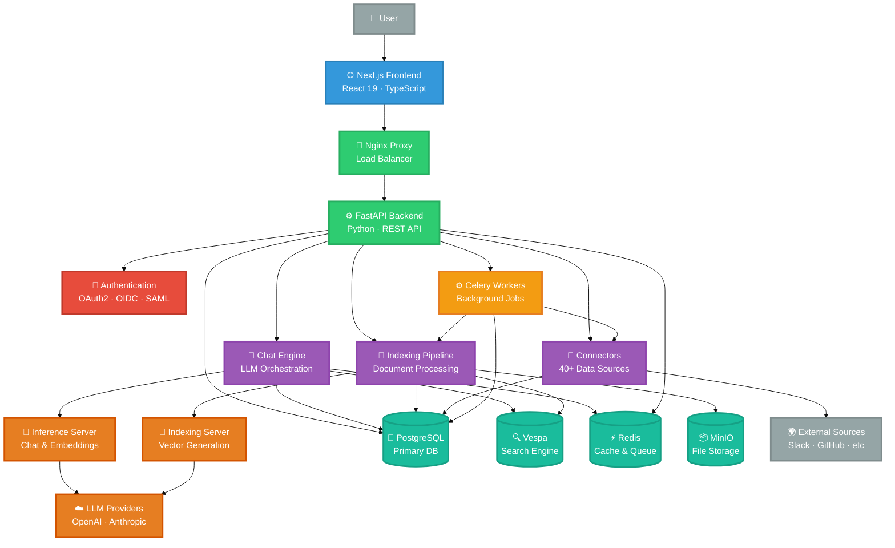
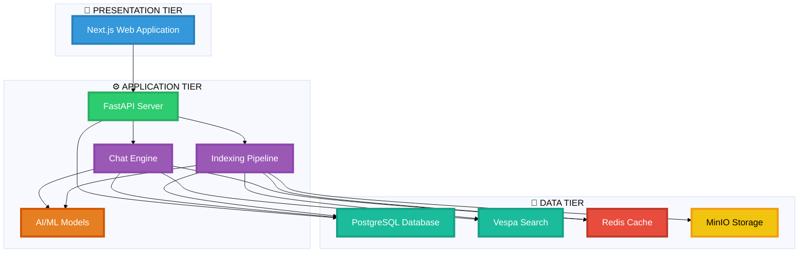
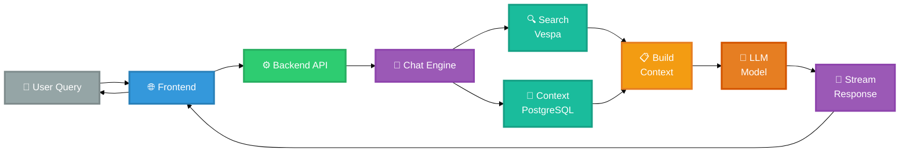
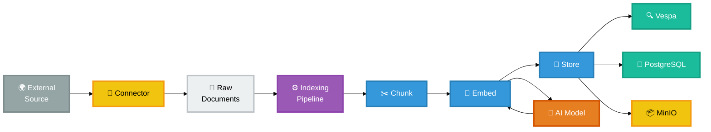

# Onyx Architecture Diagram

## Main System Architecture

---

## Simplified 3-Tier Architecture

---

## Chat Flow (Request → Response)

---

## Document Indexing Flow

---

## Component Legend

### 🎨 Presentation Layer
- **Next.js Frontend**: Web application UI (React 19, TypeScript)

### ⚙️ Application Layer
- **FastAPI Backend**: Main API server (Python, REST)
- **Chat Engine**: LLM orchestration and streaming
- **Indexing Pipeline**: Document processing and embedding
- **Connectors**: 40+ data source integrations

### 🤖 AI/ML Layer
- **Inference Server**: Chat responses and embeddings
- **Indexing Server**: Document vector generation
- **LLM Providers**: OpenAI, Anthropic, Cohere, Google

### 💾 Data Layer
- **PostgreSQL**: Primary relational database
- **Vespa**: Hybrid search engine (BM25 + vectors)
- **Redis**: Cache and async task queue
- **MinIO**: S3-compatible file storage

### ⚡ Processing Layer
- **Celery Workers**: Background job processing
- **Nginx**: Reverse proxy and load balancing

### 🌍 External Layer
- **Data Sources**: Slack, GitHub, Confluence, Gmail, etc.

---

## Technology Stack

| Layer | Technologies |
|-------|-------------|
| **Frontend** | Next.js 16, React 19, TypeScript, Tailwind CSS |
| **Backend** | FastAPI, Python 3.11-3.12, Pydantic 2 |
| **Database** | PostgreSQL 15, SQLAlchemy 2.0, Alembic |
| **Search** | Vespa 8.x (BM25 + Vector) |
| **Cache** | Redis 7.4 |
| **Storage** | MinIO (S3-compatible) |
| **Queue** | Celery + Redis |
| **AI/ML** | Sentence-Transformers, PyTorch, OpenAI, Anthropic |
| **Proxy** | Nginx 1.25.5 |

---

## Key Features

✅ **Hybrid Search**: Combines BM25 lexical search with vector embeddings
✅ **Streaming Responses**: Server-Sent Events (SSE) for real-time chat
✅ **Multi-LLM Support**: OpenAI, Anthropic, Cohere, Google, Bedrock, vLLM
✅ **40+ Connectors**: Slack, GitHub, Confluence, Gmail, Notion, and more
✅ **Background Processing**: Async indexing and connector syncing
✅ **Multi-tenant Ready**: Database design supports tenancy
✅ **Scalable**: Containerized with Docker for horizontal scaling
